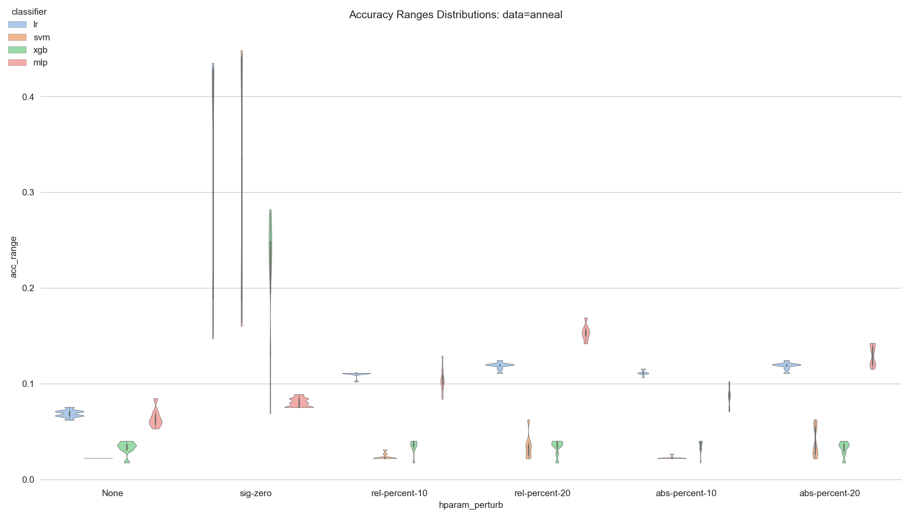
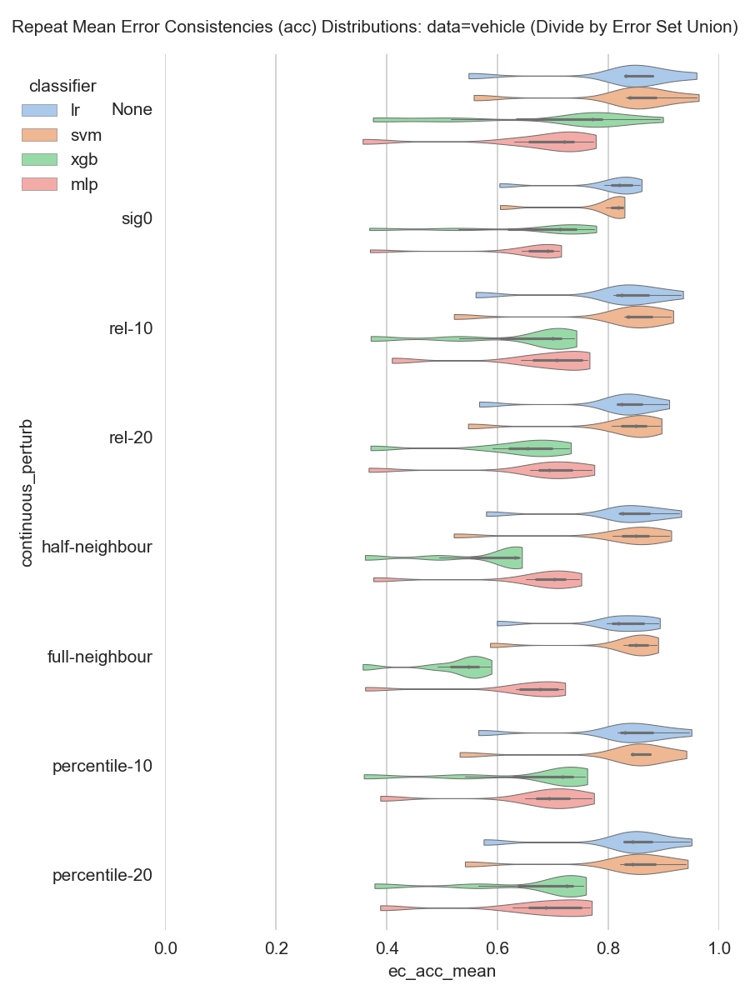

<!-- I've been working on what I call the "model variance" paper quite extensively for
the past weeks, and have preliminary results, and then some final decisions to
make for what is worth running, compute-wise. -->


# Contents
- [Overview](#overview)
- [Data](#data)
- [Classifiers](#classifiers)
- [Sources of Variance and Training Perturbation Schemes](#sources-of-variance-and-training-perturbation-schemes)
  - [Train Downsampling](#train-downsampling)
  - [Data Perturbation](#data-perturbation)
    - [Continuous Data Perturbation](#continuous-data-perturbation)
    - [Categorical Data Perturbation](#categorical-data-perturbation)
  - [Hyperparameter (Hparam) Perturbation](#hyperparameter-hparam-perturbation)
- [Evaluation Procedure](#evaluation-procedure)
- [Runtime Considerations](#runtime-considerations)
- [Serious Problems with the Local EC](#serious-problems-with-the-local-ec)
  - [The Global EC](#the-global-ec)
  - [Other EC Normalizations](#other-ec-normalizations)
    - [Accuracy-Normalized EC](#accuracy-normalized-ec)
- [Preliminary Results](#preliminary-results)
  - [Hparam Perturbation](#hparam-perturbation)
  - [Accuracy Effects](#accuracy-effects)
    - [Gross Accuracies](#gross-accuracies)
    - [Repeat Accuracy Ranges](#repeat-accuracy-ranges)
  - [Error Consistency Effects](#error-consistency-effects)
    - [Data Perturbation: Gross Effects Ignoring Repeats](#data-perturbation-gross-effects-ignoring-repeats)
    - [Repeat EC Means](#repeat-ec-means)
    - [Repeat EC Ranges](#repeat-ec-ranges)


# Overview

I examine variance in classifier *performance* (e.g. accuracy) and performance
*consistency* (e.g. metrics describing the similarity of model
predictions)—collectively, "model / classifier variance"—due to
perturbations that can occur in various aspects of the typical
tune-train-evaluate analysis pipeline. This is done by implementing a number of
*training perturbation schemes* which may operate on the training data values,
training hyperparameter (hparam) values, or which simply impact which training
samples are selected. So for example, an "hparam perturbation scheme" randomly
alters the training hparams in some way to observe the resulting model variance.

The primary unit of analysis in this study is the **repeat**. A repeat is a
collection of 10 **runs** wherein each run shares the same *test set*, but where
training is perturbed by a combination of
perturbation schemes. For example, if we have 2 hparam perturbation schemes, 3
data perturbation schemes, and 4 downsampling schemes, then there are (2 +
1)·(3 + 1)·(4 + 1) = 60 total possible combinations (we also always test "no
perturbation" for each category of perturbation scheme, hence the +1).

While the combination of perturbation schemes is fixed for each repeat, each run's training
is unique due to the random training perturbations (the exception being when all perturbations
are none, in which a deterministic classifier will have identical fits). This means
**each repeat yields a collection of 10 predictions** which can than be summarized using
various Pairwise Prediction Similarity Metrics (PPSMs) like the EC, or any other
pairwise distance / similarity metrics (e.g. Cohen's Kappa).

We also perform multiple repeats so that we can get a distribution on the various
metrics above. Each repeat has a different test set, and each repeat and run uses
a different, independently-seeded random number generator, so we expect variance
as well from repeat to repeat.


# Data

I use most of the 39 tabular datasets used in https://arxiv.org/abs/2106.11189.
I exclude two datasets (Fashion MNIST, and DevnagariScript) which are in fact
image datasets, not tabular, for 37 datasets total ([skip past to next section](#classifiers)):

| name                                   |   n_sample |   n_feat |   n_majority_cls |   n_minority_cls |   n_cls |
|:---------------------------------------|-----------:|---------:|-----------------:|-----------------:|--------:|
| arrhythmia                             |        452 |      280 |              245 |              207 |       2 |
| Australian                             |        690 |       15 |              383 |              307 |       2 |
| blood-transfusion-service-center       |        748 |        5 |              570 |              178 |       2 |
| vehicle                                |        846 |       19 |              628 |              218 |       2 |
| anneal                                 |        898 |       39 |              486 |              412 |       2 |
| credit-g                               |       1000 |       21 |              700 |              300 |       2 |
| cnae-9                                 |       1080 |      857 |              120 |              120 |       9 |
| car                                    |       1728 |        7 |             1210 |               65 |       4 |
| mfeat-factors                          |       2000 |      217 |             1800 |              200 |       2 |
| kc1                                    |       2109 |       22 |             1783 |              326 |       2 |
| segment                                |       2310 |       20 |              330 |              330 |       7 |
| jasmine                                |       2984 |      145 |             1492 |             1492 |       2 |
| kr-vs-kp                               |       3196 |       37 |             1669 |             1527 |       2 |
| sylvine                                |       5124 |       21 |             2562 |             2562 |       2 |
| phoneme                                |       5404 |        6 |             3818 |             1586 |       2 |
| christine                              |       5418 |     1637 |             2709 |             2709 |       2 |
| fabert                                 |       8237 |      801 |             1927 |              502 |       7 |
| dilbert                                |      10000 |     2001 |             2049 |             1913 |       5 |
| nomao                                  |      34465 |      119 |            24621 |             9844 |       2 |
| jungle_chess_2pcs_raw_endgame_complete |      44819 |        7 |            23062 |             4335 |       3 |
| bank-marketing                         |      45211 |       17 |            39922 |             5289 |       2 |
| adult                                  |      48842 |       15 |            37155 |            11687 |       2 |
| shuttle                                |      58000 |       10 |            45586 |               10 |       7 |
| volkert                                |      58310 |      181 |            12806 |             1361 |      10 |
| helena                                 |      65196 |       28 |             4005 |              111 |     100 |
| connect-4                              |      67557 |       43 |            44473 |             6449 |       3 |
| jannis                                 |      83733 |       55 |            38522 |             1687 |       4 |
| numerai28.6                            |      96320 |       22 |            48658 |            47662 |       2 |
| higgs                                  |      98050 |       29 |            51827 |            46223 |       2 |
| aloi                                   |     108000 |      129 |              108 |              108 |    1000 |
| MiniBooNE                              |     130064 |       51 |            93565 |            36499 |       2 |
| walking-activity                       |     149332 |        5 |            21991 |              911 |      22 |
| ldpa                                   |     164860 |        8 |            54480 |             1381 |      11 |
| skin-segmentation                      |     245057 |        4 |           194198 |            50859 |       2 |
| CreditCardFraudDetection               |     284807 |       31 |           284315 |              492 |       2 |
| Click_prediction_small                 |     399482 |       12 |           332393 |            67089 |       2 |
| dionis                                 |     416188 |       61 |             2469 |              878 |     355 |


# Classifiers

I fit as classifiers: Logistic Regression (LR), linear Support Vector Machine
(SVM), XGBoost (XGB), and a modern-ish middle-sized neural network with
dropout, batch-norm, and etc (essentially the one in [this
paper](https://arxiv.org/pdf/1705.03098.pdf)). This network is just "MLP" in
figures here and [in
code](https://github.com/stfxecutables/model_variance/blob/master/src/models/torch_base.py#L213-L238),
and is implemented in PyTorch and requires a GPU to train efficiently.

The LR and SVM models have to be fit via SGD (technically,
[SGDClassifier](https://scikit-learn.org/stable/modules/generated/sklearn.linear_model.SGDClassifier.html)),
so they are a bit non-standard, but early testing showed the plain LR and SVM
algorithms simply can't handle the larger of the 38 datasets (compute times
will be exorbitant), and that, at least on the smaller or moderate-sized
datasets, the SGD variants had about the same holdout performance anyway (often
actually slightly better).

A radial-basis SVM unfortunately cannot be easily fit via SGD. It is
technically possible by using kernel approximation, e.g. via the [Nystroem
transformer](https://scikit-learn.org/stable/modules/generated/sklearn.kernel_approximation.Nystroem.html),
but this departs heavily from the usual SVM, and introduces significant tuning
and interpretational complexity, so is not used in this study.

# Sources of Variance and Training Perturbation Schemes

A "source of (model) variance" is anything in the training procedure that might
impact the resulting predictions. I explicitly manipulate three main sources of
variance in this study: hyperparameters, data (predictor) noise, and training
sample distribution / size.

## Train Downsampling

Train downsampling by $p$ percent uses only $p$ percent of the available
training samples $\mathbf{X}$. For reasons related to stratification, compute
costs, and sample sizes, I limit $p$ to values in $\{25, 50, 75, 100\}$. That
is, we do no $k$-fold, and instead focus on Monte-Carlo-style validation. This
is primarily due to compute costs.

Although you won't see any figures depicting the effects of train downsampling
below, early tests showed *train downsampling to be the largest source of
variance in model performance and performance consistency metrics*.

## Data Perturbation

I develop a number of methods to perturb predictor values and simulate
"small" predictor noise. I classify predictor features as either continuous or
categorical, and define perturbation methods based on the feature cardinality.


### Continuous Data Perturbation

These perturbations are all designed to be "small" in various intuitive ways.
The early results perhaps show I was a bit too clever in making these small, as
they definitely don't have dramatic effects on metrics, and likely need to be
increased slightly (by a factor of 2 or so) for a final investigation.
Nevertheless...

For all descriptions below, training data is
$\mathbf{X} \in \mathbb{R}^{N \times F}$, with $N$ samples, and $F$
features, and $f$ is the perturbation function, which may be either
$f: \mathbb{R}^{N \times F} \mapsto \mathbb{R}^{N \times F}$ if it requires
the full data, or simply $f: \mathbb{R} \mapsto \mathbb{R}$ if it operates on
feature values only.

**Significant-digit**: Rewrite each feature sample $x \in \mathbb{R}$ in
scientific notation, e.g. $x =$ `1.2345eN` for some integer `N`, then define
*perturbation at the zeroth digit* to be
$f(x) = x + e, \quad e \sim \text{Unif}($`-1eN`, `1eN`$)$. *Perturbation of the first
digit* is similar but takes $e \sim \text{Unif}($`-0.1eN`, `0.1eN`$)$, and perturbation
to the third digit is $e \sim \text{Unif}($`-0.01eN`, `0.01eN`$)$, and so on.

The idea is that this is a perturbation that is "visible" to humans
when looking at rounded tables of data, and that perturbations at a level that
should be mostly invisible to humans (e.g. at the 3rd or 4th significant digit)
should NOT have dramatic impacts on classifier behavior.

**Nearest-Neighbor**: This perturbs each sample $\symbfit{x} \in \mathbb{R}^F$
to within its Voronoi cell, as defined by $\mathbf{X}$. That is, if $\symbfit{x}\_{\text{nn}}$ is
the nearest neighbour to $\symbfit{x}$, and $B(\symbfit{a}, r)$ is the
multidimensional ball of radius $r$ centred at $\symbfit{a}$, then
neighbor-based perturbation moves $\symbfit{x}$ to a
random location in $B(x,  c\cdot \lVert \symbfit{x} - \symbfit{x}_{\text{nn}} \rVert)$,
where $c \in \{0.25, 0.5, 1.0\}$. There is precedence for this in e.g.
https://arxiv.org/pdf/1905.01019.pdf, and the basic reasoning is quite sound.
E.g. at "half" neighbour perturbation (c=0.5) the perturbed value's nearest
neighbour does not change, so a KNN classifier with K=1 would not change its
predictions under this kind of perturbation.

**Relative**: For each feature sample $x \in \mathbb{R}$, define
$f(x) = x + e$, where $e \sim \text{Unif}\big(x (1 - p),x  (1 + p)\big)$, for
$p \in \{0.1, 0.2, \dots\}$.

**Percentile**: Each feature has a distribution of *absolute* values, and lower percentile $p$
for $p < 0.5$ for those absolute values.  For each feature sample $x \in \mathbb{R}$, define
$f(x) = \text{clamp}(x + e, x_{\min}, x_{\max})$, where $e \sim \text{Unif}\big(x - p / 2, x + p/2\big)$,
where $x_{\min}$ and $x_{\max}$ are the largest observed values for the feature, and where
$p \in \{0.1, 0.2, \dots\}$. We use a percentile on the absolute values to avoid overly-large
perturbations due to extreme negative or extreme positive values.


### Categorical Data Perturbation

**Sample-level**: A proportion $p$ is chosen, and $\lceil p N\rceil$ samples are chosen
to be potentially perturbed. If there are $c$ categorical features, then with
probability $\frac{1}{c}$, for each sample, each label is set to a random label in
that feature. I.e. we expect, on average, for each sample chosen for perturbation, that only
one of that sample's categorical features gets a random (possibly the same) label.
This simulates something like data entry error / noise on proportion $p$ of samples.

**Label-level**: Let $X_c$ be the $N \times c$ matrix of categorical
predictors. For small probability $p$. Define `idx = np.random.uniform(0, 1,
X_c.shape) < p`. Then the values where `idx` is True are replaced with a random
label from the available labels for that feature. That is, this is "label
noise" but in the predictors, apparently also more correctly called ["attribute
noise"](https://link.springer.com/article/10.1007/s10462-004-0751-8). This
mixing with a uniform has some resemblance to label smoothing in deep learning.


**Note**: Early experiments show that sample-level perturbation is an extremely
weak source of variance even at $p = 0.2$ (does not seem to impact performance
distributions at all).  By contrast, label-level perturbation at even $p=0.1$ has obvious performance impacts.
However, label-level perturbation is systemic and aggressive, so more likely appropriate values
for this are $p \le 0.1$.


## Hyperparameter (Hparam) Perturbation

Hyperparameters can be categorized based on their cardinality: they are either continuous,
ordinal, or categorical. They are also either logarithmic or not. For the most part,
hyperparameters can be perturbed in the same ways that the data (i.e. predictors $\mathbf{X}$)
are perturbed, and so we define *significant digit* and *relative* hparam perturbation
of continous and ordinal hparams as above. However, since we must specify viable ranges for
hparams, and don't have to worry about outliers, we can just use proportions of the
full hparam range instead of percentiles, and so all this *absolute* perturbation.


When a param is logarithmic, perturbations are done instead in
$\log_{10}$-space, and then converted back. E.g. if we have tuned the model and
found some good logarithmic parameter $\theta \in \mathbb{R}$, and are
perturbing relatively by $p = 0.1$, then, the pertubed value is $\theta + 10^e$, where
$e \sim \text{Unif}\big((1-p)\log_{10}\theta, (1 + p)\log_{10}\theta\big)$.

Ordinals are treated as continuous, but with rounding, as needed, to ensure
values stay within the original ordinal levels. Categorical hparams are
perturbed independently with probability $p$.

**Note**: Currently I forget to scale the perturbation probability for categoricals
to be proportional to the number of categorical hparams and runs. The categorical perturbation
prob is set to be in $\{0.1, 0.2\}$. With only 10 runs per repeat, this means a categorical
hparam will remain at the default or tuned value on most or even all runs, and so is
generally unperturbed within a repeat. I think this is why I am currently seeing only a
limited impact of hparam perturbation.


# Evaluation Procedure

Time permitting, I will examine each combination of model, classifier, and training perturbation schemes
in two scenarios:

**"Out-of-the-Box" Evaluations**: Scikit-Learn, XGBoost, and PyTorch provide a
number of default values for most hyperparameters. Using these hparams is
equivalent to using an "untuned" model, and we evaluate models using defaults
as a first step. In general, we should expect good PPSMs with default values or
perturbations thereof, because otherwise the defaults would not be good
defaults that work in a variety of situations. (Aside: In fact, early testing
to estimate runtimes used *completely random* hyperparameters, and in most
cases, most models still performed reasonably well most of the time.)


**Tuned Evaluations**: I plan to use random search to tune each
model-classifier-dataset combination $4 \times 4 \times 37 = 592$ tunings. The
hparams found by these tunings will then be used for ALL subsequent repeats,
runs, and combinations of perturbation scheme. Assuming somewhere between
100-200 random hparam evaluations per model, this is highly affordable on the
clusters (see [below](#runtime-considerations)).

Arguably, we also  want to know how e.g. data perturbation and downsampling
impact tuning too, but then this gets inordinately expensive.

# Runtime Considerations

Assuming:

* 2 - 4 data perturbation schemes
* 1 - 2 categorical data perturbation methods (label vs. sample)
* 2 - 4 hparam perturbation schemes
* 3 - 4 downsampling sizes (e.g. [25%, 50%, 75%, 100%])
* 4 classifiers
* 37 datasets
* 5 - 10 runs
* 5 - 10 repeats

This is 44 400 model fits at minimum, and 1 894 400 total model fits at maximum (**!**).
I have actually fit and analyzed that many models before, but the runtimes were faster.

If we limit to:

* 3 data perturbation schemes
* 2 categorical data perturbation method
* 2 hparam perturbation schemes
* 3 downsampling sizes (e.g. [50%, 75%, 100%])
* 4 classifiers
* 37 datasets
* 10 runs
* 10 repeats

this is 532 800 model fits. This is worth keeping in mind.

**Across datasets, median SINGLE-CORE runtime is 5s, except for MLP, which is more like 45s**.
95th percentile of max times is about 2min to 10minutes. Only lr-sgd and svm-sgd
get up to 30-60minutes for the Aloi and Dionis datasets. E.g. dropping Aloi and
Dionis, we get:

| classifier | 50%    | 75%    | 95%    | 97.5%  | 99%    | max    |
|:-----------|:-------|:-------|:-------|:-------|:-------|:-------|
| lr-sgd     | 4.6 s  | 10.0 s | 42.3 s | 61.3 s | 2.0 m  | 2.7 m  |
| mlp        | 38.0 s | 62.8 s | 3.6 m  | 4.0 m  | 4.4 m  | 4.8 m  |
| svm-sgd    | 2.8 s  | 7.6 s  | 25.1 s | 45.7 s | 53.8 s | 59.3 s |
| xgb        | 4.9 s  | 6.0 s  | 59.3 s | 78.8 s | 83.9 s | 87.2 s |

I.e. **all worst-case runtimes are about 1-5 minutes** and the **vast majority
are under 1 minute**. Only two datasets are problems for two classifiers
("VerySlow" below):

```
All max runtime distributions
                       mean     50%     75%     95%   97.5%     99%     max
classifier runtime
lr-sgd     Fast      <1.0 m  <1.0 m  <1.0 m  <1.0 m  <1.0 m  <1.0 m  <1.0 m
           Mid       <1.0 m  <1.0 m  <1.0 m  <1.0 m  <1.0 m  <1.0 m  <1.0 m
           Slow      <1.0 m  <1.0 m  <1.0 m   2.2 m   2.4 m   2.6 m   2.7 m
           VerySlow  45.2 m  45.2 m  51.3 m  56.2 m  56.8 m  57.1 m  57.4 m

mlp        Fast      <1.0 m  <1.0 m  <1.0 m  <1.0 m  <1.0 m  <1.0 m  <1.0 m
           Mid        1.7 m   1.1 m   1.7 m   4.2 m   4.5 m   4.6 m   4.8 m
           Slow      <1.0 m  <1.0 m  <1.0 m   1.1 m   1.1 m   1.1 m   1.1 m
           VerySlow   3.0 m   3.0 m   3.9 m   4.6 m   4.7 m   4.8 m   4.8 m

svm-sgd    Fast      <1.0 m  <1.0 m  <1.0 m  <1.0 m  <1.0 m  <1.0 m  <1.0 m
           Mid       <1.0 m  <1.0 m  <1.0 m  <1.0 m  <1.0 m  <1.0 m  <1.0 m
           Slow      <1.0 m  <1.0 m  <1.0 m  <1.0 m  <1.0 m  <1.0 m  <1.0 m
           VerySlow  32.0 m  32.0 m  32.9 m  33.6 m  33.7 m  33.7 m  33.7 m

xgb        Fast      <1.0 m  <1.0 m  <1.0 m  <1.0 m  <1.0 m  <1.0 m  <1.0 m
           Mid       <1.0 m  <1.0 m  <1.0 m  <1.0 m  <1.0 m  <1.0 m  <1.0 m
           Slow      <1.0 m  <1.0 m   1.1 m   1.4 m   1.4 m   1.4 m   1.5 m
           VerySlow   5.2 m   5.2 m   5.8 m   6.3 m   6.4 m   6.4 m   6.5 m
```

So ignoring the annoying Aloi and Dionis datasets for a moment, then at 1-5 minutes
per fit, we have:

```
   44 400 * 1min =     740hr =   31 core days
  532 800 * 1min =    8880hr =  370 core days
  532 800 * 5min =  5*8880hr = 1850 core days
1 894 400 * 5min = ~158000hr =    too much

```

With 80 cores on Niagara, **30.8 core days is in fact just under 10hrs on a single job on one node**,
and of course you can submit and run on multiple nodes in parallel. On cedar, the largest whole-node
job possible is 32 cores, so 31-core days is just 1 day on such a node.

One minute is in most cases a *MASSIVE* over-estimate, so this is all very
doable, with a couple exception datasets. Also the MLP needs GPUs, so has to be
done on e.g. Cedar. Thankfully the GPU memory needed is low, so I was able to
run e.g. 10 jobs in parallel on one GPU there with little trouble.

So it is not unreasonable to test a carefully-chosen full grid of perturbation schemes.

# Serious Problems with the Local EC

EC is a good idea, and normalizing it to be in $[0, 1]$ is also a good idea.
However, normalization via the local union results in the mean local EC (i.e.
the mean EC across all unique error set pairings) becoming mostly
uninterpretable, especially when error sets can be small.

The reason for this is that the local EC can take on only rational values
within $[0, 1]$. I.e. possible local EC values are:

$$S = \{0, \frac{1}{2}, \frac{1}{3}, \frac{2}{3}, \dots, \frac{k-1}{k}, 1\} = \{s_0, s_1, \dots, s_n\}$$

where $k \le N$ for a dataset of $N$ samples, and where $k$ describes something
like the largest possible number of samples that can be mis-predicted. If we consider
the discrete random variable $\mathbf{S}$ which can take on the values in $S$, then
each value $s_i \in S$ has probability $p_i$, and the expected value of $\mathbf{S}$
is

$$\mathbb{E}(\mathbf{S}) = \frac{1}{n} \sum_i^n p_n s_n$$

**This is the clearest _correct_ interpretation of the local EC mean I have
been able to come up with**.  However, this means that one knows essentially
nothing when examining a mean EC value (the mean of a distribution tells you
little about the nature of that distribution). That is, a mean local EC of
~0.33 could result from a bunch of values close to 333/1000, or a bunch of
values close to 1/3, or some other strange mixture of values. This is true
independently of the number of samples. I.e. a nearly-perfect classifier being
evaluated on tens of thousands of samples, and making errors only on 1-3
samples, could have a mean EC of 0.33.

The problem can technically be worse, since identical local EC distributions
could result from very different error profiles. E.g. we can imagine one classifier
where ECs have the values (or values close to)

$$\{\frac{k_1}{2k_1}, \frac{k_2}{2k_2}, \frac{k_3}{2k_3}, \dots\}, \text{ for various } k_i < k_{i+1} \in \mathbb{Z}$$

and another in which EC values are only like the first term. These classifiers
will appear to have identical EC distributions (a single spike at 0.5), but we
surely want to say that the first classifier is far more inconsistent in its
error behavior, as it makes errors on much more samples, and in much more
different ways.

This means any summary statistic using the local ECs alone will not be
interpretable nor allow comparisons of ECs from one dataset or classifier to
another, and the local EC can be viewed / interpreted only if you look at the
full distribution of values, but that, even then, dramatically different error
behaviours can still be invisible. This makes the local EC in my opinion a
flawed metric.

I think the subsequent plots also show that the local EC distributions tend to
be quite pathological (even flatter than Cauchy distributions, and support tends
to be almost all of $[0  1]$).

## The Global EC

All these problems go away if we just stop dividing by the error set union, and
do division by the test set size (i.e. we normalize by a "global" property that
is the same across all error set pairings). Division by the test set size
allows comparing ECs across data, and the interpretation is clear and
immediate: the mean global EC is the number (or proportion) of samples on which
a random pairing of classification runs can be expected to disagree on. I.e. a
mean global EC of 0.2 means that we expect two classifier predictions to disagree on
about 20% of test samples. Presumably, with enough repetitions, we expect the mean
EC to converge to 1 minus the mean accuracy.


## Other EC Normalizations

Some other alternatives which may fix the bad behaviour of the local EC are to
divide instead by the size of the largest observed error set union, by the size
of the union of *all* error sets. However, this still leaves these ECs essentially
incomparable among different runs or datasets, and we still cannot interpret the meaning
of a value like 0.2 without knowing the size of the normalizing set.

### Accuracy-Normalized EC

Another possibility for correcting the local EC is to combine it with the accuracy via geometric mean.
That is, if we have boolean error sets $\{e_i\}$, and accuracies $\{a_i\}$, define the
accuracy-normalized EC to be:


$$\text{EC}_{\text{acc}, ij} = \sqrt[3]{a_i \cdot a_j \cdot \text{EC}_{\text{local}, ij}} \quad \text{or} \quad \sqrt{ \tilde{a} \cdot \text{EC}_{\text{local}, ij}} \quad  \text{ for } \tilde{a} = \sqrt{a_i  a_j} $$

where

$$\text{EC}_{\text{local}, ij} =  \frac{\lvert e_i \cap e_j \rvert}{\lvert e_i \cup e_j \rvert} $$

The geometric mean ensures that a local EC of zero is still zero, and still results in values in
$[0, 1]$, whether to use $\sqrt[3]{}$ or not is mostly interpretability.

This **accuracy-normalized EC also has the nice property that a classifier
with nearly-zero accuracy will also have nearly-zero EC**, whereas _both_ the global
and local EC treat extremely inaccurate classifiers as highly consistent.

In general, we only care to look at the EC when accuracy has already reached
some acceptable value, so the $\text{EC}_\text{acc}$ is likely a better tool
for something like model selection. The only disadvantage is that it loses the
clear interpretability of the global EC. However, the global EC could also be
scaled in the same way. I examine all of these below.

# Preliminary Results


For preliminary tests, I chose the two fastest fitting datasets (vehicle,
anneal, which both fit in like 5 seconds) and do 10 repeats and 10 runs with a
much wider variety of perturbation schemes than would be used in a final
investigation. Ultimately this ended up in 44 800 model fits, which took about
3 hours on Niagara, plus about 40 minutes on Cedar for the MLPs.

I did not tune models, and just used hparam defaults.
I did some earlier tests as well which are not presented here, but
which basically show that training data downsampling has a much larger impact
on accuracies and error consistencies than the data and hparam perturbation
methods I chose. However, this was expected / unsurprising, and the focus of
these preliminary tests was to iron out bugs and determine which hparam and
data perturbation methods are worth including in a final presentation.


## Hparam Perturbation

## Accuracy Effects

### Gross Accuracies

Impact on accuracy distributions depends on the perturbation scheme (see
figures directly below), but perturbation at the zeroth significant digit has
the most dramatic / obvious effect. In general, the stronger the hparam perturbation
(larger $p$), the wider the global accuracy distributions.

.
.

**Above: Gross accuracy distributions**: Each row shows a different data perturbation
scheme, and each column shows a different hparam perturbation scheme. A subplot
title of "None" indicates no perturbation, so the upper left subplot is no perturbation
of any kind.

---

Also, gross accuracy distributions differ more depending on the hparam perturbation method
than on the data perturbation method (i.e. scanning the eyes horizontally across the above
grids results in more variation than vertical scans). You can also see this in the below
figures which lump together (ignore) hparam perturbation choices

|Anneal | Vehicle|
|--|--|
|| |

**Above: Gross accuracy distributions ignoring hparam perturbation**: Each column
shows a different hparam perturbation scheme. A subplot title of "None"
indicates no perturbation, so the upper subplot is no perturbation of any
kind. Only data perturbation at the zeroth significant digit results in
obvious differences (from no perturbation) to the bulk of the accuracy
distributions.

### Repeat Accuracy Ranges

By ignoring within-repetition patterns, the gross summaries hide some interesting relationships:




**Above: Distribution of accuracy ranges across repeats**: Each column shows a
different hparam perturbation scheme. "None" indicates no perturbation, so the
left-most subplot is no perturbation of any kind. Each repeat and combination
of perturbation schemes produces a set of accuracies, which has one range
(max - min). This shows the distributions of those ranges across the 10 repeats
times number of perturbation scheme combinations. For example, this plot
suggest that the MLP and XGB are actually "most consistent" both overall, and
subject to hparam perturbations, when "consistency" is defined as "smaller
repeat accuracy ranges".


## Error Consistency Effects

### Data Perturbation: Gross Effects Ignoring Repeats

As usual, significant digit perturbation has the most effect, but otherwise,
differences in the gross EC distributions are subtle. For a paper, we should
include data perturbation at the zeroth digit, but also another method below
with greater strength (e.g. relative perturbation at 50%).


| Global $\text{EC}$ | Global $\text{EC}_{\text{acc}}$ |
|-----------|--------------------------|
| |  |
| |  |


**Above: Global EC Distributions by data perturbation**: Left: Global EC. Right: Global
EC adjusted with accuracy. Note the apparent paradoxical result that hparam perturbation
can in fact *increase* global EC, even when that EC is accuracy-adjusted. This is, however,
a gross summary that ignores within-repeat effects, and so may be misleading.

---


| Local $\text{EC}$ | Local $\text{EC}_{\text{acc}}$ |
|-----------|--------------------------|
| |  |
| |  |

**Above: Local EC Distributions by data perturbation**: Left: Local EC. Right: Local
EC adjusted with accuracy. Note how often local EC distributions are quite
pathological (e.g. very flat) so that the mean and range of the distribution
do not provide much useful information about the distribution. Not also
accuracy-adjusted local EC distributions are a bit better-behaved and easier to
describe.

### Repeat EC Means

Since there are 10 repeats, and 10 runs per repeat, each repeat yields 45 pairs
of ECs. The mean of these 45 EC pairs is a single value, the "EC Mean", and the
10 of them gives us a distribution on the EC mean. These distributions are depicted
in the figures below, and have a number advantages over the gross summaries above,
in that they consider within-repeat correlations and effects.

| Global $\text{EC}$: Anneal | Global $\text{EC}_{\text{acc}}$: Anneal |
|-----------|--------------------------|
| |  |

| Global $\text{EC}$: Vehicle | Global $\text{EC}_{\text{acc}}$: Vehicle |
|-----------|--------------------------|
| |  |


**Above: Distributions of Global EC Means Across Repeats, by data perturbation**:
Left: Global EC. Right: Global EC adjusted with accuracy. Adjustment helps
narrow the distributions, but does not change the relationships between
classifiers. Note also that, compared to the gross distributions above,
there is far less overlap. **E.g. at the gross level (ignoring repeat effects),
ECs overlap significantly. But in these figures, the global EC distributions
are nearly perfectly separable**.

---


| Local $\text{EC}$: Anneal | Local $\text{EC}_{\text{acc}}$: Anneal |
|-----------|--------------------------|
| |  |

| Local $\text{EC}$: Vehicle | Local $\text{EC}_{\text{acc}}$: Vehicle |
|-----------|--------------------------|
| |  |

**Above: Distributions of Local EC Means Across Repeats, by data
perturbation**: Left: Local EC. Right: Local EC adjusted with accuracy. Note
the extremely large (unacceptable?) spread of the local EC means, especially
relative to the global EC means. Accuracy adjustment helps reduce this spread
only a little. Thankfully, patterns in the local EC repeat means are still
broadly similar to those of the global EC repeat means. **Note also that for
the MLP and XGBoost on the vehicle dataset, adjustment frequently changes which
classifier appears to be more consistent** - this is not a problem for the
global EC.

### Repeat EC Ranges

Since there are 10 repeats, and 10 runs per repeat, each repeat yields 45 pairs
of ECs. The range (max - min) of these 45 EC pairs is a single value, the "EC
Range", and the 10 of them gives us a distribution on the EC ranges
(variances). These distributions are depicted in the figures below.


| Global $\text{EC}$ | Global $\text{EC}_{\text{acc}}$ |
|-----------|--------------------------|
| |  |
| |  |


**Above: Distribution of Global EC Ranges by data perturbation**: Left: Global
EC. Right: Global EC adjusted with accuracy. Of perhaps note is that the MLP
ECs have a much lower EC range *range*: i.e. the MLPs are more consistent in their
error consistency... Also of note is that accuracy adjustment generally increases the
apparent separation of the range distributions.

---


| Local $\text{EC}$ | Local $\text{EC}_{\text{acc}}$ |
|-----------|--------------------------|
| |  |
| |  |

**Above: Distribution of Local EC Ranges by data perturbation**: Left: Local EC.
Right: Local EC adjusted with accuracy. Note how often local EC ranges
are bimodal, with the largest mode often near 1.0, and the smallest at a similar
extremely large value (e.g. 0.6). That is, within a repeat, the local EC will
typically take on most values in $[0, 1]$. Accuracy adjustment does *not* save
the local EC here, and I find the plots hard to interpret due to the bimodality.


